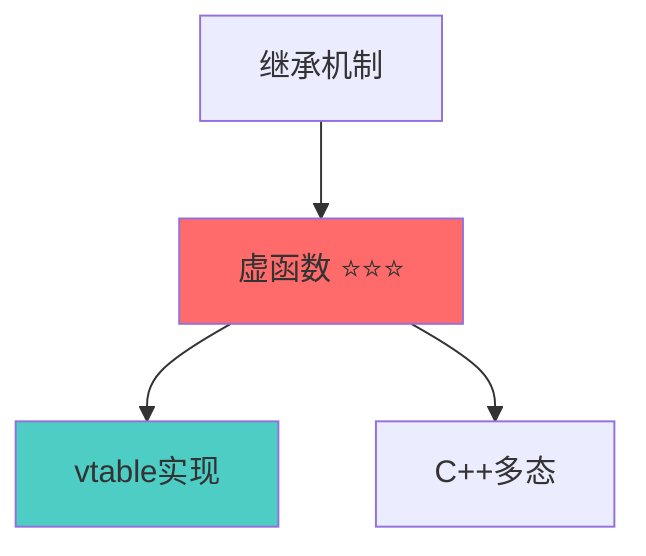
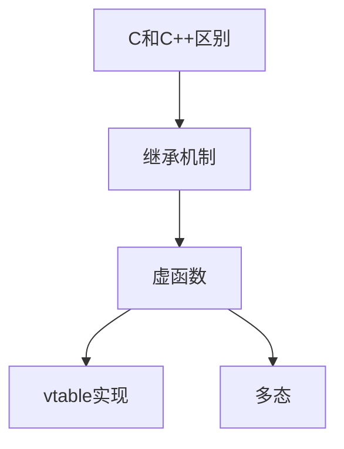

# Obsidian 笔记整理 Skill 实战指南

## 核心摘要

针对 Obsidian 知识库的 4 个核心 Skill 定义，覆盖每周总结、格式规范化、知识图谱生成和 Daily Note 自动整理，实现知识管理全流程自动化。

---

## 目录结构

建议在项目根目录创建以下结构：

```
C:/1.HYFStudy/OB/C++/c++/
├── .claude/
│   ├── skills/
│   │   ├── weekly-summary/
│   │   │   ├── SKILL.md
│   │   │   └── examples/
│   │   │       └── example-output.md
│   │   ├── note-formatter/
│   │   │   ├── SKILL.md
│   │   │   └── rules.md
│   │   ├── knowledge-graph/
│   │   │   ├── SKILL.md
│   │   │   └── templates/
│   │   │       └── graph-template.md
│   │   └── daily-organizer/
│   │       ├── SKILL.md
│   │       └── config.yaml
│   └── config.json
├── CLAUDE.md
└── (你的笔记文件...)
```

---

## Skill 1: 每周学习总结生成器

### 文件路径
`.claude/skills/weekly-summary/SKILL.md`

### 完整定义

```markdown
# weekly-summary

## Metadata
- Name: 每周学习总结生成器
- Trigger: /weekly-summary
- Version: 1.0.0
- Author: 用户
- Last Updated: 2026-01-15
- Description: 自动整理本周学习笔记并生成结构化总结

## Instruction

### Goal
自动化每周学习笔记的整理、分类、总结生成和关联链接创建流程，节省手动整理时间，保证知识体系连贯性。

### Steps

1. **确定时间范围**
   - 默认：本周（周一到周日）
   - 可选：用户指定的日期范围

2. **扫描笔记文件**
   - 查找对应日期文件夹（格式：YY-MM-DD/）
   - 收集所有 .md 文件
   - 排除以下文件：
     - .obsidian/ 目录
     - Templates/ 目录
     - 文件名包含 "temp", "draft" 的文件

3. **主题分类**
   - 根据文件路径和 YAML frontmatter 的 tags 字段分类
   - 主题包括：
     - C++（基础、模板、虚函数、编译原理）
     - UE5（Actor、Component、蓝图、材质、动画）
     - 编译系统（PE文件、Visual Studio、构建流程）
     - 设计模式（单例、工厂、策略等）
     - 计算机底层（汇编、操作系统、内存管理）
     - 其他

4. **提取关键信息**
   - 从每篇笔记提取：
     - 标题（h1）
     - 核心摘要部分
     - 关键概念（加粗文本、代码块标题）
     - TODO 项完成状态
   - 识别重要性（根据笔记长度、复杂度标签）

5. **生成周总结**
   - 使用模板创建新文件
   - 文件名：`Weekly-{year}-W{week_number}.md`
   - 位置：根目录下的 `Summaries/` 文件夹

6. **创建双向链接**
   - 在周总结中链接到原始笔记
   - 在原始笔记末尾添加反向链接（如果不存在）
   - 格式：`[[Weekly-2026-W03]]`

7. **更新月度进度**
   - 读取 `Monthly-Progress-{year}-{month}.md`
   - 如果不存在则创建
   - 添加本周学习条目
   - 更新学习统计数据

### Constraints

- **文件操作限制**
  - 只读取 .md 文件
  - 不修改原始笔记内容（除了添加反向链接）
  - 不处理二进制文件或图片

- **格式要求**
  - 严格遵循 CLAUDE.md 中定义的 YAML frontmatter 规范
  - 输出文件使用 Templates/AI_Refactor_Rules.md 的格式
  - 保持中文内容的语言一致性

- **错误处理**
  - 如果找不到任何笔记，输出提示信息并退出
  - 如果周总结文件已存在，询问是否覆盖
  - 记录无法解析的文件，在总结末尾列出

### Input

```yaml
# 可选参数
start_date: "2026-01-13"  # 开始日期（默认：本周一）
end_date: "2026-01-19"    # 结束日期（默认：本周日）
topics: ["C++", "UE5"]    # 只处理指定主题（默认：全部）
include_todos: true       # 是否包含 TODO 统计（默认：true）
create_backlinks: true    # 是否创建反向链接（默认：true）
```

### Output Format

```markdown
---
creation_date: {生成日期}
type: #Type/Summary
status: #Status/Active
tags: [Weekly_Summary, {year}, W{week_number}]
week_range: "{start_date} - {end_date}"
total_notes: {笔记数量}
---

# Weekly Summary - {year} 第 {week_number} 周

## 本周概览

- 学习笔记数：{count}
- 主要主题：{topics}
- 学习时间跨度：{start_date} 至 {end_date}
- 完成度：{completed_todos / total_todos * 100}%

---

## 按主题分类

### C++ 相关

#### 核心概念
- [[笔记标题1]] - 简短描述
- [[笔记标题2]] - 简短描述

#### 关键收获
{从笔记中提取的核心摘要内容}

---

### UE5 相关

#### 核心概念
...

#### 关键收获
...

---

## 本周亮点

1. **最重要的概念**：{提炼的核心知识点}
2. **解决的难题**：{记录的问题和解决方案}
3. **待深入学习**：{标记为待办或疑问的内容}

---

## 知识关联

### 新建关联
{本周新建立的概念链接}

### 强化关联
{本周重复学习/加深理解的概念}

---

## 下周计划

基于本周学习内容，建议：
1. {根据学习路径.md 提出的后续学习建议}
2. {未完成的 TODO 迁移}

---

## 原始笔记列表

### C++
- [[26-01-13/虚函数表详解]] - 2026-01-13
- [[26-01-14/模板特化]] - 2026-01-14
...

### UE5
...

---

## 统计数据

| 指标 | 数值 |
|------|------|
| 笔记总数 | {count} |
| C++ 相关 | {count} |
| UE5 相关 | {count} |
| 编译系统 | {count} |
| 设计模式 | {count} |
| 完成的 TODO | {count} |
| 待办 TODO | {count} |

---

## 元数据
- 生成时间：{timestamp}
- 生成工具：Claude Code - weekly-summary skill
- 版本：v1.0.0
```

## Resources

### Required Tools
- **Read**: 读取笔记文件、CLAUDE.md、Templates
- **Write**: 创建周总结文件、更新月度进度
- **Grep**: 搜索特定主题的笔记
- **Glob**: 匹配日期文件夹和 .md 文件
- **Edit**: 在原始笔记中添加反向链接（可选）

### Context Files
- **CLAUDE.md**: 笔记格式规范、目录结构
- **Templates/AI_Refactor_Rules.md**: 输出格式模板
- **学习路径.md**: 主题分类和学习阶段定义

### External Dependencies
- 无（纯文件操作）

## Permissions

### Required
- Read: 整个 vault（排除 .obsidian/workspace.json）
- Write:
  - Summaries/ 目录（创建周总结）
  - Monthly-Progress-*.md（更新月度进度）

### Optional
- Edit: 原始笔记文件（添加反向链接）
  - 只在笔记末尾添加，不修改现有内容
  - 用户可选择禁用

### Forbidden
- 不得删除任何文件
- 不得修改 .obsidian/ 配置
- 不得修改原始笔记的核心内容

## Examples

见 `.claude/skills/weekly-summary/examples/example-output.md`

## Version History

### v1.0.0 (2026-01-15)
- 初始版本
- 基础功能：扫描、分类、生成总结
- 支持双向链接创建
- 月度进度更新

## Troubleshooting

### 问题1：找不到笔记文件
**症状**：执行后提示"未找到任何笔记"
**解决**：
1. 检查日期文件夹命名格式是否为 `YY-MM-DD/`
2. 确认文件夹中有 .md 文件
3. 检查 CLAUDE.md 中的目录结构定义

### 问题2：分类不准确
**症状**：笔记被分到错误的主题下
**解决**：
1. 检查笔记的 YAML frontmatter 中的 tags 字段
2. 更新 学习路径.md 中的主题定义
3. 手动调整生成的总结文件

### 问题3：反向链接重复
**症状**：原始笔记中出现多个相同的反向链接
**解决**：
1. Skill 会自动检测已存在的链接
2. 如果出现重复，手动清理或禁用 create_backlinks 选项
```

---

## Skill 2: 笔记格式规范化工具

### 文件路径
`.claude/skills/note-formatter/SKILL.md`

### 完整定义

```markdown
# note-formatter

## Metadata
- Name: 笔记格式规范化工具
- Trigger: /format-notes
- Version: 1.0.0
- Description: 批量规范化笔记格式，确保符合 CLAUDE.md 定义的标准

## Instruction

### Goal
批量检测和修复笔记格式问题，确保所有笔记符合 Templates/AI_Refactor_Rules.md 定义的规范。

### Steps

1. **扫描目标文件**
   - 用户可指定：
     - 单个文件
     - 文件夹（递归）
     - 主题分类（如所有 C++ 笔记）
   - 默认：扫描整个 vault

2. **格式检测**
   - 检查 YAML frontmatter：
     - 是否存在
     - 必需字段是否完整
     - 字段格式是否正确
   - 检查文档结构：
     - 是否有"核心摘要"
     - 是否有"详细分析"
     - 是否有"关联知识"
   - 检查代码块：
     - 是否标记语言类型
     - 缩进是否正确
   - 检查标题层级：
     - 是否从 h1 开始
     - 层级是否连续（不跳级）

3. **生成诊断报告**
   - 列出所有问题
   - 按严重程度分类：
     - 🔴 严重：缺少必需字段、结构错误
     - 🟡 警告：格式不规范、建议优化
     - 🟢 建议：可选改进项
   - 统计问题数量

4. **自动修复（用户确认后）**
   - 添加缺失的 YAML frontmatter
   - 补充默认字段值
   - 规范化标题层级
   - 添加缺失的文档结构部分
   - 修复代码块格式

5. **生成修复报告**
   - 记录修改的文件
   - 列出每个文件的修改内容
   - 提供回滚建议

### Constraints

- **安全第一**
  - 修改前自动备份
  - 用户必须确认批量修改
  - 提供撤销选项

- **保留原意**
  - 只修复格式，不改变内容语义
  - 保留用户的写作风格
  - 不自动删除任何内容

### Input

```yaml
target: "26-01-15/"           # 目标路径
mode: "check"                 # check（仅检测）或 fix（修复）
severity: ["critical", "warning"]  # 处理的问题级别
backup: true                  # 是否备份
```

### Output Format

```markdown
# 笔记格式诊断报告

生成时间：{timestamp}
扫描范围：{target}
文件数量：{count}

---

## 问题统计

| 严重程度 | 数量 | 文件数 |
|---------|------|--------|
| 🔴 严重 | {count} | {file_count} |
| 🟡 警告 | {count} | {file_count} |
| 🟢 建议 | {count} | {file_count} |

---

## 详细问题列表

### 🔴 严重问题

#### [[26-01-13/未命名.md]]
- 缺少 YAML frontmatter
- 缺少"核心摘要"部分
- 建议修复：添加完整的 frontmatter 和文档结构

#### [[26-01-14/FFT.md]]
- YAML frontmatter 格式错误
- 建议修复：...

---

### 🟡 警告问题

...

---

## 修复建议

### 快速修复（推荐）
运行 `/format-notes --mode fix` 自动修复所有问题

### 手动修复
{针对特殊情况的手动修复指南}

---

## 备份信息
- 备份路径：.claude/backups/{timestamp}/
- 回滚命令：`/rollback {timestamp}`
```

## Resources

### Required Tools
- Read, Write, Edit, Glob

### Context Files
- CLAUDE.md
- Templates/AI_Refactor_Rules.md

## Permissions

### Required
- Read: 整个 vault
- Write: 修复模式下修改笔记文件
- Write: 创建备份文件

### Forbidden
- 不得删除任何内容（只添加和格式化）
```

---

## Skill 3: 知识图谱生成器

### 文件路径
`.claude/skills/knowledge-graph/SKILL.md`

### 完整定义

```markdown
# knowledge-graph

## Metadata
- Name: 知识图谱生成器
- Trigger: /build-graph
- Version: 1.0.0
- Description: 分析笔记关联关系，生成知识图谱和学习路径

## Instruction

### Goal
自动分析 vault 中所有笔记的关联关系，生成可视化的知识图谱，识别核心概念节点和学习路径。

### Steps

1. **收集所有笔记**
   - 扫描整个 vault
   - 提取每篇笔记的：
     - 标题
     - 标签（tags）
     - 双向链接 `[[link]]`
     - 前向声明
     - 引用的概念

2. **构建关系图**
   - 创建节点：每篇笔记 = 一个节点
   - 创建边：
     - 显式链接（`[[]]`）
     - 标签关联（相同标签的笔记）
     - 主题关联（同属一个主题）
   - 计算权重：
     - 被引用次数（入度）
     - 引用其他笔记次数（出度）
     - 标签重叠度

3. **识别核心节点**
   - 高入度节点：被广泛引用的基础概念
   - 高出度节点：综合性文档（如 MOC）
   - 聚类中心：某个主题的核心笔记

4. **生成可视化图谱**
   - 使用 Mermaid 语法
   - 节点大小 = 重要性
   - 颜色 = 主题分类
   - 边的粗细 = 关联强度

5. **生成学习路径**
   - 基于 学习路径.md 和图谱分析
   - 推荐学习顺序：
     - 从基础到高级
     - 从理论到实践
   - 标注前置知识

6. **创建 MOC（Map of Content）**
   - 为每个主题生成 MOC 文件
   - 包含：
     - 该主题下的所有笔记
     - 推荐阅读顺序
     - 概念依赖关系

### Output Format

#### 1. KnowledgeGraph.md

```markdown
---
creation_date: {timestamp}
type: #Type/MOC
tags: [Knowledge_Graph, Meta]
---

# 知识图谱总览

## 统计数据
- 总笔记数：{count}
- 总链接数：{count}
- 核心概念数：{count}
- 主题数：{count}

---

## 可视化图谱



---

## 核心概念排名

### Top 10 基础概念（被引用最多）
1. [[虚函数]] - 被引用 15 次
2. [[前向声明]] - 被引用 12 次
3. [[模板]] - 被引用 10 次
...

### Top 10 综合文档（引用其他概念最多）
1. [[C++面向对象全解析]] - 引用 20 个概念
2. [[UE对象系统架构]] - 引用 18 个概念
...

---

## 按主题分类

### C++ 基础
- 核心节点：[[虚函数]], [[模板]], [[继承]]
- 笔记数：{count}
- MOC: [[C++核心概念MOC]]

### UE5 架构
- 核心节点：[[Actor]], [[Component]], [[Gameplay Framework]]
- 笔记数：{count}
- MOC: [[UE5架构MOC]]

...

---

## 学习路径建议

见 [[LearningPath-Recommended.md]]
```

#### 2. LearningPath-Recommended.md

```markdown
# 推荐学习路径

基于知识图谱分析生成的学习路径建议。

---

## 路径 1：C++ 底层到 UE5 引擎

### 阶段 1：C++ 基础（预计 2-3 周）
前置知识：无

1. [[C和C++的区别]] - 起点
2. [[C++编译流程]] - 理解编译机制
3. [[虚函数]] ⭐ 核心概念
   - 依赖：理解继承
   - 引出：vtable、多态
4. [[模板]] ⭐ 核心概念
   - 依赖：理解编译期和运行期
5. [[前向声明]] - 实践技巧

### 阶段 2：编译系统（预计 2 周）
前置知识：阶段 1

1. [[PE文件格式]]
2. [[Visual Studio 编译流程]]
3. [[Build.cs 配置]]

### 阶段 3：UE5 对象系统（预计 3-4 周）
前置知识：阶段 1, 2

1. [[CDO]] ⭐⭐ 核心概念
2. [[Actor]]
3. [[Component]]
4. [[Controller]]
...

---

## 路径 2：快速上手 UE5 开发

（略）
```

#### 3. 各主题的 MOC 文件

例如：`C++核心概念MOC.md`

```markdown
# C++ 核心概念 MOC

## 概览
本 MOC 汇总所有 C++ 相关的核心概念笔记，按学习顺序组织。

---

## 基础概念

### 必读（⭐⭐⭐）
- [[虚函数]] - 理解 C++ 多态的基础
- [[模板]] - 理解泛型编程
- [[继承]] - 理解面向对象

### 推荐阅读（⭐⭐）
- [[前向声明]] - 实践技巧
- [[内联函数]] - 性能优化
...

### 扩展阅读（⭐）
...

---

## 依赖关系图



---

## 相关主题
- [[编译系统MOC]]
- [[UE5对象系统MOC]]
```

## Resources

### Required Tools
- Read, Write, Glob, Grep

### Context Files
- 所有笔记文件
- CLAUDE.md
- 学习路径.md

## Permissions

### Required
- Read: 整个 vault
- Write: 创建 MOC 文件、图谱文件

## Version History

### v1.0.0 (2026-01-15)
- 初始版本
- 基础图谱分析
- Mermaid 可视化
- MOC 生成
```

---

## Skill 4: Daily Note 自动整理器

### 文件路径
`.claude/skills/daily-organizer/SKILL.md`

### 完整定义

```markdown
# daily-organizer

## Metadata
- Name: Daily Note 自动整理器
- Trigger: /organize-daily
- Schedule: 每天 23:00 自动执行（可选）
- Version: 1.0.0
- Description: 自动整理当天的笔记、TODO 和学习内容

## Instruction

### Goal
每天自动整理当日笔记，提取学习要点，迁移未完成任务，更新学习进度。

### Steps

1. **读取今日笔记**
   - 查找今天日期的文件夹（YY-MM-DD/）
   - 读取所有 .md 文件
   - 识别 daily note（如果有）

2. **提取 TODO 状态**
   - 收集所有 `- [ ]` 和 `- [x]` 项
   - 统计完成率
   - 识别未完成的重要任务

3. **提取学习要点**
   - 识别新学习的概念
   - 提取关键代码示例
   - 记录疑问和待解决的问题

4. **生成今日总结**
   - 创建结构化的日总结
   - 保存到当天文件夹

5. **迁移未完成任务**
   - 将未完成的 TODO 迁移到明天的 daily note
   - 标注来源日期
   - 更新优先级

6. **更新周进度**
   - 累积本周学习数据
   - 更新周计划文件

### Output Format

```markdown
---
creation_date: {date}
type: #Type/Daily_Summary
tags: [Daily, {date}]
completed_todos: {count}
total_todos: {count}
---

# Daily Summary - {date}

## 今日概览
- 学习时长：{估算}
- 完成笔记：{count} 篇
- TODO 完成率：{percentage}%

---

## 学习内容

### 新学概念
- [[概念1]] - 简要描述
- [[概念2]] - 简要描述

### 关键收获
{提炼的核心内容}

### 疑问记录
- [ ] 问题1
- [ ] 问题2

---

## 任务状态

### 已完成 ✅
- [x] 任务1
- [x] 任务2

### 未完成 🔄（已迁移至明日）
- [ ] 任务3
- [ ] 任务4

---

## 明日计划
基于今日进度，明天应该：
1. 继续学习：{topic}
2. 解决疑问：{question}
3. 完成任务：{task}

---

## 元数据
- 生成时间：{timestamp}
- 生成工具：daily-organizer skill v1.0.0
```

## Resources

### Required Tools
- Read, Write, Edit

### Context Files
- 今日笔记文件
- 明日 daily note（可能需要创建）

## Permissions

### Required
- Read: 今日文件夹
- Write:
  - 创建 Daily Summary
  - 更新明日 daily note

## Version History

### v1.0.0 (2026-01-15)
- 初始版本
```

---

## 使用流程

### 初始设置

1. **创建 .claude 目录结构**

```bash
mkdir -p .claude/skills/weekly-summary/examples
mkdir -p .claude/skills/note-formatter
mkdir -p .claude/skills/knowledge-graph/templates
mkdir -p .claude/skills/daily-organizer
```

2. **复制 Skill 定义文件**

将上述 4 个 Skill 的完整定义分别保存到对应的 `SKILL.md` 文件中。

3. **测试 Skill**

```bash
# 测试每周总结
/weekly-summary --dry-run

# 测试格式检查
/format-notes --mode check --target "26-01-15/"

# 测试知识图谱
/build-graph

# 测试日整理
/organize-daily
```

### 日常使用

#### 每日使用
```bash
# 晚上整理今日笔记
/organize-daily
```

#### 每周使用
```bash
# 周日晚上生成周总结
/weekly-summary

# 或指定日期范围
/weekly-summary --start 2026-01-13 --end 2026-01-19
```

#### 定期维护
```bash
# 每月检查一次笔记格式
/format-notes --mode check

# 每月更新一次知识图谱
/build-graph
```

---

## 最佳实践

### 1. 建立习惯

- **每天睡前**：运行 `/organize-daily`
- **每周日晚**：运行 `/weekly-summary`
- **每月初**：运行 `/build-graph` + `/format-notes`

### 2. 参数化配置

在 `.claude/config.json` 中保存常用配置：

```json
{
  "skills": {
    "weekly-summary": {
      "default_topics": ["C++", "UE5", "编译系统"],
      "create_backlinks": true,
      "include_todos": true
    },
    "note-formatter": {
      "auto_backup": true,
      "severity": ["critical", "warning"]
    },
    "knowledge-graph": {
      "min_links": 2,
      "include_orphans": false
    }
  }
}
```

### 3. 渐进式采用

**第一周**：只使用 `/organize-daily`，熟悉自动化流程
**第二周**：加入 `/weekly-summary`，体验周总结自动化
**第三周**：尝试 `/format-notes`，规范化旧笔记
**第四周**：运行 `/build-graph`，建立知识体系

### 4. 自定义扩展

根据个人需求修改 Skill：
- 调整输出格式
- 添加新的主题分类
- 自定义统计指标
- 集成其他工具（如 git 自动提交）

---

## 故障排查

### 常见问题

#### 1. Skill 无法找到
**症状**：运行 `/weekly-summary` 提示"未找到 Skill"
**解决**：
- 检查 `.claude/skills/weekly-summary/SKILL.md` 是否存在
- 运行 `/skills` 列出所有可用 Skill
- 重启 Claude Code

#### 2. 权限被拒绝
**症状**：Skill 执行时提示"Permission denied"
**解决**：
- 检查 Skill 定义中的 Permissions 部分
- 手动授权：在执行时选择"Allow"
- 在 `.claude/config.json` 中添加持久权限

#### 3. 输出格式不符合预期
**症状**：生成的文件格式混乱
**解决**：
- 检查 CLAUDE.md 和 Templates/AI_Refactor_Rules.md 是否正确
- 手动修正一次，然后更新 Skill 的 Output Format 部分
- 运行 `/format-notes` 统一格式

---

## 进阶：Skill 组合

### 创建 meta-skill

`.claude/skills/weekly-workflow/SKILL.md`:

```markdown
# weekly-workflow

## Metadata
- Name: 每周自动化工作流
- Trigger: /weekly-workflow
- Description: 组合多个 Skill 完成每周自动化流程

## Instruction

### Steps
1. 运行 `/organize-daily` 确保今日笔记已整理
2. 运行 `/weekly-summary` 生成本周总结
3. 运行 `/format-notes --mode check` 检查新笔记格式
4. 如果有格式问题，询问用户是否修复
5. 更新 `/build-graph` 刷新知识图谱
6. 生成综合报告

### Output
综合报告包含：
- 本周总结
- 格式检查结果
- 知识图谱更新
- 下周学习建议
```

使用：
```bash
/weekly-workflow
```

---

## 附录

### A. 示例输出文件

见各 Skill 目录下的 `examples/` 文件夹。

### B. 配置文件模板

见 `.claude/config.json.example`。

### C. 视频教程

（可以录制使用演示视频）

---

## 更新日志

- 2026-01-15: 创建完整的 Obsidian 笔记整理 Skill 套件
  - 每周总结生成器
  - 笔记格式规范化工具
  - 知识图谱生成器
  - Daily Note 自动整理器
  - 组合工作流示例
