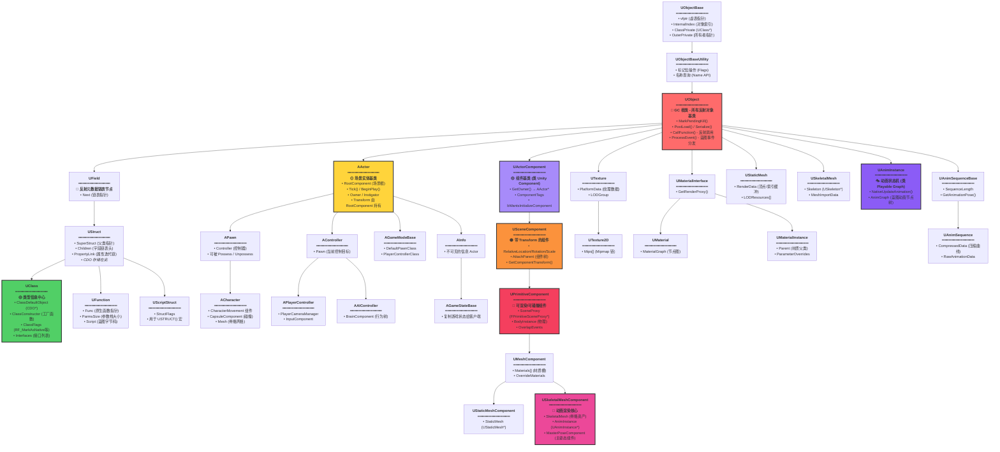

## 你好白板2

这是一个简单的白板笔记，中间写上“你好”。

```mermaid
graph TD
    %% 顶层基类层 - 内存管理与反射根
    UObjectBase["<b>UObjectBase</b><br/>━━━━━━━━━━━━━━<br/>• vfptr (虚表指针)<br/>• InternalIndex (对象索引)<br/>• ClassPrivate (UClass*)<br/>• OuterPrivate (所有者指针)"]
    
    UObjectBaseUtility["<b>UObjectBaseUtility</b><br/>━━━━━━━━━━━━━━<br/>• 标记位操作 (Flags)<br/>• 名称查询 (Name API)"]
    
    UObject["<b>UObject</b><br/>━━━━━━━━━━━━━━<br/>🔴 <b>GC 根类 - 所有反射对象基类</b><br/>• MarkPendingKill()<br/>• PostLoad() / Serialize()<br/>• CallFunction() - 反射调用<br/>• ProcessEvent() - 蓝图事件分发"]

    %% 核心反射元数据层
    UField["<b>UField</b><br/>━━━━━━━━━━━━━━<br/>🔵 <b>反射元数据链表节点</b><br/>• Next (链表指针)"]
    
    UStruct["<b>UStruct</b><br/>━━━━━━━━━━━━━━<br/>• SuperStruct (父类指针)<br/>• Children (字段链表头)<br/>• PropertyLink (属性迭代链)<br/>• <i>CDO 存储在此</i>"]
    
    UClass["<b>UClass</b><br/>━━━━━━━━━━━━━━<br/>🟢 <b>类型信息中心</b><br/>• ClassDefaultObject (CDO*)<br/>• ClassConstructor (工厂函数)<br/>• ClassFlags (RF_MarkAsNative等)<br/>• Interfaces (接口列表)"]
    
    UFunction["<b>UFunction</b><br/>━━━━━━━━━━━━━━<br/>• Func (原生函数指针)<br/>• ParmsSize (参数栈大小)<br/>• Script (蓝图字节码)"]
    
    UScriptStruct["<b>UScriptStruct</b><br/>━━━━━━━━━━━━━━<br/>• StructFlags<br/>• 用于 USTRUCT() 宏"]

    %% 游戏框架层 - Actor 体系
    AActor["<b>AActor</b><br/>━━━━━━━━━━━━━━<br/>🟡 <b>场景实体基类</b><br/>• RootComponent (场景根)<br/>• Tick() / BeginPlay()<br/>• Owner / Instigator<br/>• Transform 由 RootComponent 持有"]
    
    APawn["<b>APawn</b><br/>━━━━━━━━━━━━━━<br/>• Controller (控制器)<br/>• 可被 Possess / Unpossess"]
    
    ACharacter["<b>ACharacter</b><br/>━━━━━━━━━━━━━━<br/>• CharacterMovement 组件<br/>• CapsuleComponent (碰撞)<br/>• Mesh (骨骼网格)"]
    
    AController["<b>AController</b><br/>━━━━━━━━━━━━━━<br/>• Pawn (当前控制目标)"]
    
    APlayerController["<b>APlayerController</b><br/>━━━━━━━━━━━━━━<br/>• PlayerCameraManager<br/>• InputComponent"]
    
    AAIController["<b>AAIController</b><br/>━━━━━━━━━━━━━━<br/>• BrainComponent (行为树)"]
    
    AGameModeBase["<b>AGameModeBase</b><br/>━━━━━━━━━━━━━━<br/>• DefaultPawnClass<br/>• PlayerControllerClass"]
    
    AInfo["<b>AInfo</b><br/>━━━━━━━━━━━━━━<br/>• 不可见的信息 Actor"]
    
    AGameStateBase["<b>AGameStateBase</b><br/>━━━━━━━━━━━━━━<br/>• 复制游戏状态给客户端"]

    %% 组件层 - 类似 Unity GameObject/Component 模型
    UActorComponent["<b>UActorComponent</b><br/>━━━━━━━━━━━━━━<br/>🟣 <b>组件基类 (类 Unity Component)</b><br/>• GetOwner() → AActor*<br/>• ComponentTags<br/>• bWantsInitializeComponent"]
    
    USceneComponent["<b>USceneComponent</b><br/>━━━━━━━━━━━━━━<br/>🟠 <b>带 Transform 的组件</b><br/>• RelativeLocation/Rotation/Scale<br/>• AttachParent (组件树)<br/>• GetComponentTransform()"]
    
    UPrimitiveComponent["<b>UPrimitiveComponent</b><br/>━━━━━━━━━━━━━━<br/>🔴 <b>可渲染/可碰撞组件</b><br/>• SceneProxy (FPrimitiveSceneProxy*)<br/>• BodyInstance (物理)<br/>• OverlapEvents"]
    
    UMeshComponent["<b>UMeshComponent</b><br/>━━━━━━━━━━━━━━<br/>• Materials[] (材质槽)<br/>• OverrideMaterials"]
    
    UStaticMeshComponent["<b>UStaticMeshComponent</b><br/>━━━━━━━━━━━━━━<br/>• StaticMesh (UStaticMesh*)"]
    
    USkeletalMeshComponent["<b>USkeletalMeshComponent</b><br/>━━━━━━━━━━━━━━<br/>🎨 <b>动画渲染核心</b><br/>• SkeletalMesh (骨骼资产)<br/>• AnimInstance (UAnimInstance*)<br/>• MasterPoseComponent (主姿态组件)"]

    %% 资源/资产层
    UTexture["<b>UTexture</b><br/>━━━━━━━━━━━━━━<br/>• PlatformData (纹理数据)<br/>• LODGroup"]
    
    UTexture2D["<b>UTexture2D</b><br/>━━━━━━━━━━━━━━<br/>• Mips[] (Mipmap 链)"]
    
    UMaterialInterface["<b>UMaterialInterface</b><br/>━━━━━━━━━━━━━━<br/>• GetRenderProxy()"]
    
    UMaterial["<b>UMaterial</b><br/>━━━━━━━━━━━━━━<br/>• MaterialGraph (节点图)"]
    
    UMaterialInstance["<b>UMaterialInstance</b><br/>━━━━━━━━━━━━━━<br/>• Parent (材质父类)<br/>• ParameterOverrides"]
    
    UStaticMesh["<b>UStaticMesh</b><br/>━━━━━━━━━━━━━━<br/>• RenderData (顶点/索引缓冲)<br/>• LODResources[]"]
    
    USkeletalMesh["<b>USkeletalMesh</b><br/>━━━━━━━━━━━━━━<br/>• Skeleton (USkeleton*)<br/>• MeshImportData"]

    %% 动画系统 (对应 Unity Playable)
    UAnimInstance["<b>UAnimInstance</b><br/>━━━━━━━━━━━━━━<br/>🎭 <b>动画状态机 (类 Playable Graph)</b><br/>• NativeUpdateAnimation()<br/>• AnimGraph (蓝图动画节点树)"]
    
    UAnimSequenceBase["<b>UAnimSequenceBase</b><br/>━━━━━━━━━━━━━━<br/>• SequenceLength<br/>• GetAnimationPose()"]
    
    UAnimSequence["<b>UAnimSequence</b><br/>━━━━━━━━━━━━━━<br/>• CompressedData (压缩曲线)<br/>• RawAnimationData"]

    %% 继承关系
    UObjectBase --> UObjectBaseUtility
    UObjectBaseUtility --> UObject
    
    UObject --> UField
    UField --> UStruct
    UStruct --> UClass
    UStruct --> UFunction
    UStruct --> UScriptStruct
    
    UObject --> AActor
    UObject --> UActorComponent
    UObject --> UTexture
    UObject --> UMaterialInterface
    UObject --> UStaticMesh
    UObject --> USkeletalMesh
    UObject --> UAnimSequenceBase
    UObject --> UAnimInstance
    
    AActor --> APawn
    AActor --> AController
    AActor --> AGameModeBase
    AActor --> AInfo
    APawn --> ACharacter
    AController --> APlayerController
    AController --> AAIController
    AInfo --> AGameStateBase
    
    UActorComponent --> USceneComponent
    USceneComponent --> UPrimitiveComponent
    UPrimitiveComponent --> UMeshComponent
    UMeshComponent --> UStaticMeshComponent
    UMeshComponent --> USkeletalMeshComponent
    
    UTexture --> UTexture2D
    UMaterialInterface --> UMaterial
    UMaterialInterface --> UMaterialInstance
    UAnimSequenceBase --> UAnimSequence
    
    style UObject fill:#ff6b6b,stroke:#333,stroke-width:3px
    style UClass fill:#51cf66,stroke:#333,stroke-width:3px
    style AActor fill:#ffd43b,stroke:#333,stroke-width:3px
    style UActorComponent fill:#a78bfa,stroke:#333,stroke-width:3px
    style USceneComponent fill:#fb923c,stroke:#333,stroke-width:3px
    style UPrimitiveComponent fill:#f43f5e,stroke:#333,stroke-width:3px
    style USkeletalMeshComponent fill:#ec4899,stroke:#333,stroke-width:3px
    style UAnimInstance fill:#8b5cf6,stroke:#333,stroke-width:3px
```
