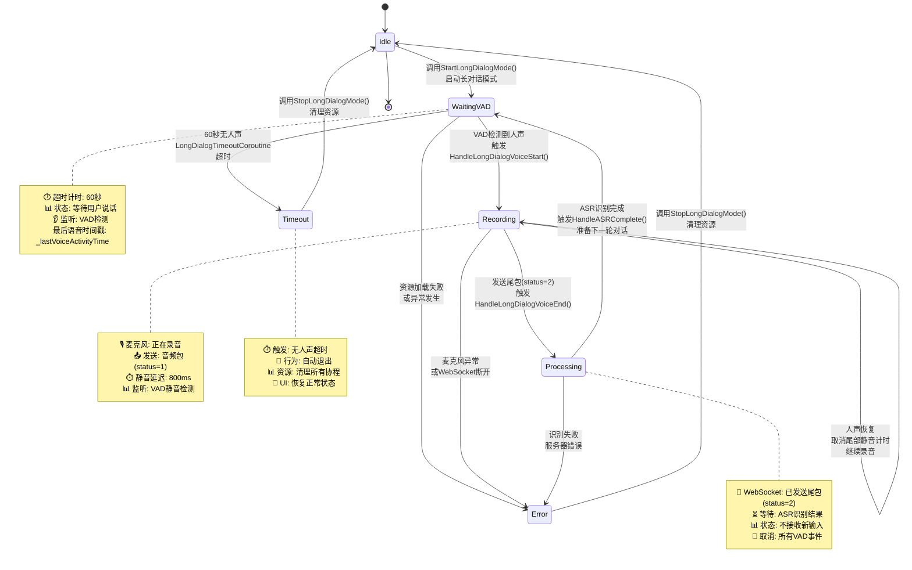

# 长对话模式详细流程图

  

**文档版本**: v1.0

**生成日期**: 2026-01-19

**系统**: YiTiJi_Move 长对话模式（Long Dialog Mode）

**主要参考**: 长对话模式实施总结.md 和 长对话模式测试指南.md

  

---

  

## 📋 目录

  

1. [用户交互完整流程图](#用户交互完整流程图)

2. [状态机详细转换图](#状态机详细转换图)

3. [组件交互时序图](#组件交互时序图)

4. [WebSocket通信流程](#websocket通信流程)

5. [流程图图例](#流程图图例)

  

---

  

## 用户交互完整流程图

  

### 从唤醒到多轮对话的完整过程

```mermaid

graph TD

    A["🎤 开始"] --> B{"用户唤醒?"}

    B -->|语音唤醒<br/>说'小白小白'| C["📢 VoiceWakeup.cs<br/>检测唤醒词"]

    B -->|按钮点击<br/>点击麦克风按钮| D["🖱️ UI Button Click<br/>触发按钮事件"]

  

    C --> E["✅ 唤醒验证成功"]

    D --> E

  

    E --> F["📝 Record.AwakeRecord()<br/>进入长对话模式"]

    F --> G["🎯 Record.EnterLongDialogMode()<br/>设置 _isInLongDialogMode=true"]

    G --> H["🔄 VADASRController.StartLongDialogMode()<br/>启动长对话模式"]

  

    H --> I["📊 初始化长对话状态<br/>State = Idle → WaitingVAD<br/>启动60秒超时计时器"]

    I --> J["👂 订阅VAD事件<br/>OnVoiceActivityChanged"]

    J --> K["⏳ 系统等待VAD检测人声<br/>UI显示:WaveBG激活,麦克风隐藏"]

  

    K --> L{"VAD检测到<br/>人声?"}

    L -->|是 - 说话开始| M["🔊 SileroVADManager<br/>检测到人声"]

    L -->|否 - 继续等待| K

  

    M --> N["📞 HandleLongDialogVoiceStart()<br/>更新_lastVoiceActivityTime"]

    N --> O["🎬 状态转换<br/>WaitingVAD → Recording"]

    O --> P["🎙️ Record.StartRecordingByVAD()<br/>启动麦克风录音"]

    P --> Q["📤 发送首包(status=0)<br/>通知服务器开始识别"]

  

    Q --> R["📊 持续录音中<br/>循环发送音频包(status=1)<br/>保持WebSocket连接"]

    R --> S{"用户说话<br/>还在继续?"}

    S -->|继续说话| R

    S -->|说话结束<br/>检测到静音| T["🔇 SileroVADManager<br/>检测到静音"]

  

    T --> U["📞 HandleLongDialogVoiceEnd()<br/>启动尾部静音计时"]

    U --> V["⏱️ 等待800ms静音延迟<br/>LongDialogTailSilenceCoroutine"]

  

    V --> W{"800ms内<br/>有人声恢复?"}

    W -->|有 - 继续说话| X["↩️ 取消尾部静音计时<br/>继续回到录音状态"]

    W -->|无 - 确认结束| Y["📤 发送尾包(status=2)<br/>通知服务器结束识别"]

  

    X --> R

    Y --> Z["🎯 状态转换<br/>Recording → Processing"]

    Z --> AA["⏳ 等待ASR识别结果<br/>UI持续显示WaveBG"]

  

    AA --> AB["✅ XunFei返回识别结果<br/>MessageCenter.SendMessage<br/>CoustmonsSpeekOver"]

    AB --> AC["📞 HandleASRComplete()<br/>接收ASR识别完成消息"]

    AC --> AD["🎬 状态转换<br/>Processing → WaitingVAD"]

  

    AD --> AE["🔄 系统回到等待状态<br/>WaitingVAD - 等待下一轮对话"]

    AE --> AF{"继续对话?"}

    AF -->|继续 - 无需重新唤醒| AG["💬 第二轮对话开始"]

    AF -->|继续 - 第三轮| AH["💬 第三轮对话开始"]

    AF -->|退出| AI{"退出方式?"}

  

    AG --> K

    AH --> K

  

    AI -->|60秒无人声超时| AJ["⏱️ LongDialogTimeoutCoroutine<br/>超时时间已到"]

    AI -->|手动点击关闭| AK["🖱️ OnClickCloseRecord()<br/>用户点击遮罩层"]

    AI -->|网络异常| AL["⚠️ 网络连接断开"]

  

    AJ --> AM["🎬 状态转换<br/>WaitingVAD → Timeout"]

    AK --> AN["🛑 Record.ExitLongDialogMode()<br/>手动退出长对话模式"]

    AL --> AN

  

    AM --> AN

    AN --> AO["🎯 VADASRController.StopLongDialogMode()<br/>清理长对话模式资源"]

    AO --> AP["❌ 取消订阅VAD事件"]

    AP --> AQ["🧹 停止所有协程<br/>- 超时计时器<br/>- 尾部静音计时器"]

    AQ --> AR["🎨 恢复UI状态<br/>WaveBG隐藏,麦克风显示"]

    AR --> AS["✅ 返回正常待机状态<br/>下次需重新唤醒"]

    AS --> A_END["🏁 结束"]

  

    style A fill:#90EE90

    style A_END fill:#FFB6C6

    style K fill:#87CEEB

    style R fill:#87CEEB

    style AA fill:#FFD700

    style AS fill:#DDA0DD

```

  



  

### 流程说明

  

| 阶段 | 时间 | 关键操作 | 状态 |

|------|------|---------|------|

| **唤醒阶段** | 实时 | 识别唤醒词或点击按钮 | Idle → WaitingVAD |

| **人声检测** | <150ms | VAD检测到人声 | WaitingVAD → Recording |

| **录音阶段** | 可变 | 发送首包和中间包 | Recording |

| **静音计时** | 800ms | 等待确认说话结束 | Recording |

| **发送尾包** | <100ms | 发送尾包并进入处理状态 | Recording → Processing |

| **识别等待** | 网络延迟 | 等待服务器返回结果 | Processing |

| **识别完成** | <200ms | 处理识别结果 | Processing → WaitingVAD |

| **多轮对话** | 持续 | 无需重新唤醒，循环进行 | WaitingVAD循环 |

| **超时退出** | 60秒 | 无人声自动退出 | WaitingVAD → Timeout |

  

---

  

## 状态机详细转换图

  

### 6种状态的完整转换关系

  



  

### 状态转换详细参数

  

#### 1️⃣ **Idle → WaitingVAD**

```

触发条件:

  - 调用 VADASRController.StartLongDialogMode()

  

初始化:

  - _isLongDialogMode = true

  - _longDialogState = WaitingVAD

  - _lastVoiceActivityTime = Time.time

  - 启动 LongDialogTimeoutCoroutine (60秒)

  - 订阅 _vadManager.OnVoiceActivityChanged 事件

  

输出:

  - MessageCenter 发布 LongDialogStateChangedMessage

  - Console 输出: "========== 长对话模式启动 =========="

  - UI更新: WaveBG激活，麦克风隐藏

```

  

#### 2️⃣ **WaitingVAD → Recording**

```

触发条件:

  - VAD检测到人声活动 (OnVoiceActivityChanged: true)

  - 当前状态为 WaitingVAD

  

执行步骤:

  1. _lastVoiceActivityTime = Time.time (更新最后语音时间)

  2. TransitionLongDialogState(LongDialogState.Recording)

  3. StartRecordingSession():

     - Record.StartRecordingByVAD()

     - 启动麦克风录音

     - Microphone.Start(null, false, 60, 16000)

     - 启动 GetAudoiDataFirst() 协程

  4. 发送首包: WebSocket status=0 (开始识别)

  

时间参数:

  - 录音启动延迟: < 100ms

  - VAD检测延迟: < 150ms (从开始说话到此)

  

输出:

  - Console: "[VADASRController] Long Dialog - VAD检测到人声 (状态: WaitingVAD)"

  - Console: "[Record] VAD触发：开始录音"

```

  

#### 3️⃣ **Recording → Processing**

```

触发条件:

  - VAD检测到静音 (OnVoiceActivityChanged: false)

  - 当前状态为 Recording

  - 800ms静音延迟确认后 (LongDialogTailSilenceCoroutine)

  

执行步骤:

  1. HandleLongDialogVoiceEnd() - 人声结束处理

  2. StartCoroutine(LongDialogTailSilenceCoroutine())

  3. 等待800ms，检查是否继续有人声

  4. 如果静音确认:

     - Record.StopRecordingByVAD()

     - 发送尾包: WebSocket status=2 (结束识别)

     - 停止发送音频包

     - TransitionLongDialogState(LongDialogState.Processing)

  

时间参数:

  - 静音延迟: 800ms (可配置: longDialogVADSilenceDelayMs)

  - 从停止说话到发送尾包: ~800ms

  

输出:

  - Console: "[VADASRController] Long Dialog - 尾部静音计时开始 (800ms)"

  - Console: "[VADASRController] Long Dialog - 静音确认，停止录音并发送尾包"

  - Console: "[Record] VAD触发：停止录音（发送尾包）"

```

  

#### 4️⃣ **Recording → Recording (人声恢复)**

```

触发条件:

  - 在尾部静音计时期间 (800ms内)

  - VAD再次检测到人声

  - 当前状态为 Recording

  

执行步骤:

  1. HandleLongDialogVoiceStart() 重新触发

  2. 取消 LongDialogTailSilenceCoroutine 协程

  3. 继续发送音频包 (status=1)

  4. _lastVoiceActivityTime = Time.time (更新时间戳)

  5. 保持 Recording 状态，不转换

  

时间参数:

  - 取消窗口: 800ms (必须在尾部静音计时器完成前)

  

输出:

  - Console: "[VADASRController] Long Dialog - 人声恢复，取消尾部静音计时"

  - 继续发送音频包到服务器

```

  

#### 5️⃣ **Processing → WaitingVAD**

```

触发条件:

  - ASR识别完成

  - 接收到 CoustmonsSpeekOver 消息

  - 当前状态为 Processing

  

执行步骤:

  1. HandleASRComplete() - ASR完成处理

  2. 处理识别结果 (可选的UI更新、语音合成等)

  3. _lastVoiceActivityTime = Time.time (更新时间戳)

  4. TransitionLongDialogState(LongDialogState.WaitingVAD)

  5. 准备接收下一轮对话

  

时间参数:

  - 识别延迟: 取决于网络和服务器处理速度

  - 状态转换: < 50ms

  

输出:

  - Console: "[VADASRController] Long Dialog - ASR识别完成: [识别结果]"

  - Console: "[VADASRController] Long Dialog State: Processing -> WaitingVAD"

  - Console: "[VADASRController] Long Dialog - 准备好接收下一轮对话"

  - UI: 保持WaveBG激活，等待下一句话

```

  

#### 6️⃣ **WaitingVAD → Timeout**

```

触发条件:

  - 当前状态为 WaitingVAD

  - 60秒内没有检测到任何人声活动

  - LongDialogTimeoutCoroutine 计时器超时

  

执行步骤:

  1. LongDialogTimeoutCoroutine() 检查: Time.time - _lastVoiceActivityTime > 60

  2. 当前为 WaitingVAD 且已超时

  3. TransitionLongDialogState(LongDialogState.Timeout)

  4. 调用 StopLongDialogMode() 清理资源

  5. 转换到 Idle 状态

  

时间参数:

  - 超时时间: 60秒 (可配置: longDialogTimeoutSeconds)

  - 检查频率: 每帧检查

  

输出:

  - Console: "[VADASRController] Long Dialog - 超时 (60秒无人声)"

  - Console: "[VADASRController] ========== 长对话模式结束 =========="

  - UI: WaveBG隐藏，麦克风显示

```

  

#### 7️⃣ **任何状态 → Error**

```

触发条件:

  - 麦克风初始化失败

  - VAD初始化异常

  - WebSocket连接断开

  - 内存不足或其他运行时异常

  

执行步骤:

  1. 捕获异常或检测到错误条件

  2. TransitionLongDialogState(LongDialogState.Error, "错误原因")

  3. 记录错误日志

  4. 调用 StopLongDialogMode() 清理资源

  5. 转换到 Idle 状态

  

输出:

  - Console.LogError: 详细的错误信息

  - MessageCenter: 发布错误消息

```

  

---

  

## 组件交互时序图

  

### 从用户说话到ASR完成的时序交互

```mermaid

sequenceDiagram

    actor User as 👤 用户

    participant UI as 🎨 UI<br/>Record.cs

    participant VADCtrl as 🎯 VADASRController<br/>控制器

    participant VADMgr as 👂 SileroVADManager<br/>VAD检测

    participant Mic as 🎤 Microphone<br/>麦克风

    participant XFMgr as 📡 XunFeiManager<br/>WebSocket

    participant Server as 🌐 XunFei Server<br/>识别服务

  

    User ->> User: 进入长对话模式<br/>(唤醒或点击)

    User ->> UI: 触发 AwakeRecord()

  

    UI ->> UI: 调用 EnterLongDialogMode()

    UI ->> VADCtrl: 调用 StartLongDialogMode()

  

    VADCtrl ->> VADCtrl: _longDialogState = Idle → WaitingVAD

    VADCtrl ->> VADMgr: 订阅 OnVoiceActivityChanged 事件

    VADCtrl ->> VADCtrl: 启动 LongDialogTimeoutCoroutine (60秒计时)

  

    Note over VADCtrl: ⏳ 系统等待VAD检测人声<br/>状态: WaitingVAD

  

    User ->> User: 开始说话

  

    Mic ->> VADMgr: 连续输入音频数据<br/>(每帧更新)

    VADMgr ->> VADMgr: 分析音频特征<br/>计算能量、频率等

  

    alt VAD检测到人声

        VADMgr ->> VADCtrl: OnVoiceActivityChanged(true)<br/>触发人声开始事件

        VADCtrl ->> VADCtrl: HandleLongDialogVoiceStart()

        VADCtrl ->> VADCtrl: _longDialogState = WaitingVAD → Recording

        VADCtrl ->> VADCtrl: _lastVoiceActivityTime = Time.time

  

        VADCtrl ->> UI: 调用 StartRecordingByVAD()

        UI ->> Mic: Microphone.Start(null, false, 60, 16000)

        Mic ->> Mic: 初始化麦克风<br/>16kHz采样率

  

        UI ->> UI: 启动 GetAudoiDataFirst() 协程<br/>开始采集音频

  

        Note over XFMgr: 📤 准备WebSocket连接

        UI ->> XFMgr: 通过 GetAudoiDataFirst() 发送首包

        XFMgr ->> Server: WebSocket send<br/>status=0 (开始识别)<br/>+ 首段音频数据

        Server ->> Server: 初始化识别会话<br/>创建识别缓冲区

  

        Note over VADCtrl,Mic: 🎙️ 连续录音阶段<br/>用户持续说话

    end

  

    loop 每帧 - 持续录音

        Mic ->> Mic: 获取音频数据

        UI ->> UI: 在 GetAudoiDataNext() 中<br/>收集音频样本

        UI ->> XFMgr: 发送中间包<br/>status=1 + 音频块

        XFMgr ->> Server: WebSocket send (连续)

        Server ->> Server: 缓存音频<br/>实时处理

    end

  

    User ->> User: 停止说话

    Mic ->> VADMgr: 音频能量下降

    VADMgr ->> VADMgr: 检测到静音特征

    VADMgr ->> VADCtrl: OnVoiceActivityChanged(false)<br/>触发人声结束事件

  

    VADCtrl ->> VADCtrl: HandleLongDialogVoiceEnd()

    VADCtrl ->> VADCtrl: 启动 LongDialogTailSilenceCoroutine()<br/>等待800ms确认

  

    Note over VADCtrl: ⏱️ 尾部静音计时<br/>800ms延迟<br/>防止过短停顿误触发

  

    alt 800ms内有人声恢复

        Mic ->> VADMgr: 音频能量再次上升

        VADMgr ->> VADCtrl: OnVoiceActivityChanged(true)<br/>人声恢复

        VADCtrl ->> VADCtrl: 取消 LongDialogTailSilenceCoroutine

        VADCtrl ->> VADCtrl: 保持 Recording 状态<br/>继续录音

        Note over VADCtrl,Mic: 🔄 返回录音状态

    else 800ms确认无人声

        Note over VADCtrl: ⏱️ 800ms计时完成<br/>确认说话结束

        VADCtrl ->> VADCtrl: _longDialogState = Recording → Processing

        VADCtrl ->> UI: 调用 StopRecordingByVAD()

  

        UI ->> Mic: Microphone.End()

        Mic ->> Mic: 停止录音

  

        UI ->> UI: 停止 GetAudoiDataNext() 循环

  

        Note over XFMgr: 📤 准备发送尾包

        UI ->> XFMgr: 发送尾包<br/>status=2 (结束识别)

        XFMgr ->> Server: WebSocket send<br/>status=2 + 可能的最后音频块

        Server ->> Server: 结束识别会话<br/>触发语音识别<br/>开始文本处理

    end

  

    Note over VADCtrl: 📊 状态: Processing<br/>⏳ 等待ASR识别结果

  

    Server ->> Server: 执行语音识别<br/>- 音频解码<br/>- 特征提取<br/>- 模型推断<br/>- 文本输出

  

    Server ->> XFMgr: 返回识别结果<br/>status完成或流式结果

    XFMgr ->> XFMgr: 解析返回数据<br/>提取识别文本

  

    XFMgr ->> VADCtrl: 发送 CoustmonsSpeekOver 消息<br/>MessageCenter.SendMessage()

  

    VADCtrl ->> VADCtrl: HandleASRComplete()<br/>监听该消息

    VADCtrl ->> VADCtrl: _lastVoiceActivityTime = Time.time

    VADCtrl ->> VADCtrl: _longDialogState = Processing → WaitingVAD

  

    VADCtrl ->> UI: 通知识别完成

    UI ->> UI: 可选: 更新UI<br/>显示识别结果

  

    Note over VADCtrl: ✅ 状态: WaitingVAD<br/>准备接收下一轮对话<br/>🔄 无需重新唤醒

  

    User ->> User: 说第二句话<br/>(无需重新唤醒)

  

    Note over VADCtrl: 🔁 循环回到<br/>VAD检测阶段<br/>开始第二轮对话

```

  



  

### 时序图关键时间指标

  

| 阶段 | 参与组件 | 时间参数 | 备注 |

|------|---------|---------|------|

| **人声检测** | VADMgr → VADCtrl | < 150ms | 从开始说话到VAD事件触发 |

| **麦克风启动** | VADCtrl → UI → Mic | < 100ms | 从VAD检测到麦克风Recording |

| **首包发送** | UI → XFMgr → Server | < 50ms | 从GetAudoiDataFirst启动到发送 |

| **中间包循环** | UI → XFMgr → Server | 每帧 | 持续发送status=1的音频块 |

| **静音检测** | VADMgr → VADCtrl | < 150ms | 从停止说话到VAD事件触发 |

| **尾部静音延迟** | VADCtrl (Coroutine) | 800ms | 确认说话结束 |

| **尾包发送** | UI → XFMgr → Server | < 50ms | 从StopRecordingByVAD到发送 |

| **ASR处理** | Server | 取决于服务器 | 通常200-500ms |

| **结果返回** | XFMgr → VADCtrl → VADCtrl | < 100ms | 从Server返回到状态转换 |

| **多轮对话循环** | 完整过程 | 取决于用户 | 从第一个人声到下一个人声 |

  

### 协程生命周期

  

```

┌─────────────────────────────────────────────────────────────────┐

│                    长对话模式完整协程图                          │

└─────────────────────────────────────────────────────────────────┘

  

进入长对话模式 (StartLongDialogMode)

    ├─ LongDialogTimeoutCoroutine (60秒计时)

    │   ├─ 每帧检查: Time.time - _lastVoiceActivityTime

    │   ├─ 触发条件: 超过60秒 AND 状态=WaitingVAD

    │   └─ 最终: 转换到Timeout状态并退出

    │

    ├─ GetAudoiDataFirst (首包发送)

    │   ├─ 条件: StartRecordingByVAD时启动

    │   ├─ 作用: 获取第一块音频数据并发送status=0

    │   └─ 转换: 成功后启动GetAudoiDataNext

    │

    ├─ GetAudoiDataNext (中间包循环)

    │   ├─ 条件: GetAudoiDataFirst完成后

    │   ├─ 作用: 持续获取音频数据并发送status=1

    │   ├─ 循环: 直到StopRecordingByVAD调用

    │   └─ 结束: 中断协程，准备发送尾包

    │

    └─ LongDialogTailSilenceCoroutine (800ms延迟)

        ├─ 条件: HandleLongDialogVoiceEnd时启动

        ├─ 延迟: 800ms (longDialogVADSilenceDelayMs)

        ├─ 取消: 人声恢复时立即停止 (StopCoroutine)

        └─ 完成: 800ms后调用StopRecordingByVAD

  

退出长对话模式 (StopLongDialogMode)

    └─ 清理所有协程: StopAllCoroutines()

        ├─ 停止 LongDialogTimeoutCoroutine

        ├─ 停止 GetAudoiDataNext (如果正在运行)

        └─ 停止 LongDialogTailSilenceCoroutine (如果正在运行)

```

  

---

  

## WebSocket通信流程

  

### 三态包完整通信过程

```mermaid

graph TD

    A["🎤 用户说话"] --> B["👂 VAD检测到人声<br/>HandleLongDialogVoiceStart"]

  

    B --> C["📞 Record.StartRecordingByVAD()<br/>启动麦克风录音"]

    C --> D["🎙️ Microphone.Start()<br/>开始采集音频"]

    D --> E["📤 启动 GetAudoiDataFirst()"]

  

    E --> F["📊 采集首段音频数据<br/>通常100-200ms"]

    F --> G["🔗 WebSocket连接建立<br/>连接到 XunFei Server"]

  

    G --> H["📤 发送首包<br/>━━━━━━━━━━━━━━━━━━<br/>status = 0<br/>┌─────────────────┐<br/>│ 首段音频数据     │<br/>│ + 识别参数       │<br/>│ + 业务参数       │<br/>└─────────────────┘"]

  

    H --> I["✅ Server收到首包<br/>初始化识别会话<br/>创建缓冲区<br/>准备实时处理"]

  

    I --> J["🔁 启动 GetAudoiDataNext()<br/>持续采集音频"]

  

    J --> K["📤 连续发送中间包<br/>━━━━━━━━━━━━━━━━━━<br/>status = 1<br/>┌─────────────────┐<br/>│ 第N个音频块     │<br/>│ (20-50ms数据)   │<br/>│ 重复N次         │<br/>└─────────────────┘"]

  

    K --> L["📡 Server实时处理<br/>- 缓存音频<br/>- 特征提取<br/>- 流式识别<br/>- 返回中间结果"]

  

    L --> M{"用户说话<br/>还在继续?"}

  

    M -->|是| N["🔄 继续发送status=1<br/>GetAudoiDataNext循环"]

    N --> K

  

    M -->|否| O["🔇 用户停止说话<br/>VAD检测到静音<br/>HandleLongDialogVoiceEnd"]

  

    O --> P["⏱️ 启动尾部静音计时<br/>LongDialogTailSilenceCoroutine<br/>等待800ms确认"]

  

    P --> Q["⏳ 800ms延迟中..."]

    Q --> R{"800ms内<br/>有人声<br/>恢复?"}

  

    R -->|有| S["↩️ 取消尾部静音计时<br/>人声恢复<br/>继续循环到K"]

  

    R -->|无| T["✅ 800ms确认<br/>说话结束<br/>调用StopRecordingByVAD"]

  

    T --> U["⛔ 停止GetAudoiDataNext<br/>中断中间包发送循环"]

    U --> V["📤 发送尾包<br/>━━━━━━━━━━━━━━━━━━<br/>status = 2<br/>┌─────────────────┐<br/>│ 最后音频块      │<br/>│ (可能为空)      │<br/>│ + 结束标记      │<br/>└─────────────────┘"]

  

    V --> W["✅ Server收到尾包<br/>- 完成音频缓存<br/>- 执行语音识别<br/>- 优化识别结果<br/>- 生成最终文本"]

  

    W --> X["📊 Server处理中<br/>ASR引擎处理<br/>通常200-500ms"]

  

    X --> Y["📨 返回识别结果<br/>━━━━━━━━━━━━━━━━━━<br/>状态码: success/error<br/>识别文本: '用户说的话'<br/>置信度: 0.95<br/>其他信息: ..."]

  

    Y --> Z["🔗 关闭WebSocket<br/>当前会话完成<br/>连接关闭"]

  

    Z --> AA["📞 XunFeiManager收到结果<br/>解析JSON响应<br/>提取文本"]

  

    AA --> AB["📢 发送消息<br/>MessageCenter.SendMessage<br/>CoustmonsSpeekOver"]

  

    AB --> AC["📞 VADASRController.HandleASRComplete<br/>监听CoustmonsSpeekOver消息"]

  

    AC --> AD["🎯 状态转换<br/>Processing → WaitingVAD"]

  

    AD --> AE["✅ 长对话模式<br/>准备下一轮对话<br/>无需重新唤醒"]

  

    AE --> AF{"继续对话?"}

    AF -->|继续| A

    AF -->|退出| AG["🛑 调用StopLongDialogMode<br/>清理资源<br/>恢复正常状态"]

  

    AG --> AH["🏁 结束"]

  

    style H fill:#FFE4B5

    style K fill:#FFE4B5

    style V fill:#FFB6C1

    style Y fill:#C0FFEE

    style AD fill:#90EE90

```

  



  

### WebSocket数据包格式详解

  

#### 📤 **首包 (status=0)**

```json

{

  "status": 0,

  "format": "audio/L16;rate=16000",

  "audio": "base64编码的音频二进制数据",

  "appid": "应用ID",

  "key": "会话密钥",

  "audio_bytes": 3200,

  "chunk_size": 3200,

  "chunks": 1

}

```

**特点**:

- 标记识别会话的开始

- 包含识别参数和首段音频

- Server收到此包后初始化识别缓冲区

- 通常在GetAudoiDataFirst()中发送

  

#### 📡 **中间包 (status=1)**

```json

{

  "status": 1,

  "format": "audio/L16;rate=16000",

  "audio": "base64编码的音频二进制数据",

  "audio_bytes": 3200,

  "chunk_size": 3200,

  "chunks": "N"

}

```

**特点**:

- 标记识别过程中的连续数据

- 每个包通常包含20-50ms的音频

- Server接收后实时处理和缓存

- 可能立即返回流式识别结果

- 在GetAudoiDataNext()循环中持续发送

  

#### 📤 **尾包 (status=2)**

```json

{

  "status": 2,

  "format": "audio/L16;rate=16000",

  "audio": "",

  "audio_bytes": 0

}

```

**特点**:

- 标记识别会话的结束

- 通常不包含音频数据(或为空)

- Server收到此包后停止等待新数据

- 触发最终识别处理和文本生成

- 在StopRecordingByVAD()中发送

  

### 通信时序详解

  

```

时间轴:

0ms      - 用户开始说话

         ↓

100-150ms - VAD检测到人声

         ↓

150-250ms - 首包(status=0)发送

         │  ├─ 标记: 开始识别

         │  └─ 数据: 首个100-150ms的音频

         ↓

250-XXms - 中间包循环(status=1)

         │  ├─ 20-50ms间隔发送

         │  ├─ 用户持续说话期间持续发送

         │  └─ Server实时缓存和处理

         ↓

XX00ms   - 用户停止说话

        ↓

XX00-    - 静音延迟(800ms)

XX800ms ↓

XX800ms - 尾包(status=2)发送

         │  ├─ 标记: 结束识别

         │  └─ 数据: 空或最后音频块

         ↓

XX800-   - ASR处理中(200-500ms)

YY000ms ├─ Server执行语音识别

         ├─ 文本处理和优化

         └─ 生成最终结果

         ↓

YY000ms - 结果返回

         ├─ WebSocket返回识别文本

         └─ 关闭连接

         ↓

YY050ms - 处理完成

         ├─ 状态回到WaitingVAD

         └─ 准备下一轮

         ↓

YY100+ms - 用户可以说第二句

         └─ 无需重新唤醒!

```

  

### 实现细节

  

#### 🔗 **WebSocket连接管理**

```

连接生命周期:

1. GetAudoiDataFirst()启动

   ├─ XunFeiManager.ConnectAndStartRecord()

   ├─ 建立WebSocket连接到XunFei Server

   └─ 准备发送数据

  

2. 发送status=0首包

   ├─ 初始化识别会话

   ├─ Server返回确认

   └─ 开始发送status=1

  

3. GetAudoiDataNext()循环

   ├─ 持续发送status=1

   ├─ Server持续处理

   └─ 可能返回流式结果

  

4. StopRecordingByVAD()调用

   ├─ 发送status=2尾包

   ├─ Server完成识别处理

   └─ 返回最终结果

  

5. 关闭连接

   ├─ WebSocket.Close()

   ├─ 当前会话结束

   └─ 长对话模式保持活跃(准备下一轮)

```

  

#### 📊 **音频数据格式**

```

格式: PCM L16 (Little Endian, 16-bit)

采样率: 16000 Hz

声道: 单声道

字节率: 32000 bytes/s (16000 * 2)

  

计算:

- 20ms音频: 16000/1000 * 20 * 2 = 640 bytes

- 50ms音频: 16000/1000 * 50 * 2 = 1600 bytes

  

Microphone.Start()参数:

Microphone.Start(null, false, 60, 16000)

        ├─ null: 使用默认麦克风

        ├─ false: 一次性录音(不循环)

        ├─ 60: 最长60秒缓冲

        └─ 16000: 16kHz采样率

```

  

#### 🔄 **错误恢复机制**

```

错误场景处理:

1. WebSocket连接断开

   ├─ XunFeiManager检测到断开

   ├─ 停止发送数据

   ├─ Record.StopRecordingByVAD()

   └─ 转换到Error状态

  

2. 超时无响应

   ├─ 接收超时(20-30秒)

   ├─ StopRecordingByVAD()

   └─ 长对话模式退出

  

3. 格式错误

   ├─ Server返回错误码

   ├─ 记录错误日志

   └─ 回到WaitingVAD(不影响下一轮)

```

  

---

  

## 流程图图例

  

### 符号说明

  

| 符号 | 含义 | 示例 |

|------|------|------|

| 🎤 | 麦克风/声音输入 | 用户说话 |

| 👂 | 监听/检测 | VAD检测 |

| 🎯 | 目标/控制器 | VADASRController |

| 🎬 | 状态转换 | State Machine |

| 📤 | 发送数据 | WebSocket发送 |

| 📨 | 接收数据 | Server返回 |

| 🔗 | 连接 | WebSocket连接 |

| ⏱️ | 计时器 | 800ms延迟 |

| ✅ | 成功/确认 | 检查完成 |

| ❌ | 失败/停止 | 退出长对话 |

| 🔄 | 循环/重复 | 多轮对话 |

| 🧹 | 清理资源 | 释放协程 |

| ⏳ | 等待中 | 等待结果 |

| 📊 | 数据/状态 | 当前状态 |

  

### 状态颜色代码

  

| 颜色 | 状态类型 | 示例 |

|------|---------|------|

| 🟢 绿色 | 开始/成功 | Idle → WaitingVAD |

| 🔵 蓝色 | 活跃处理 | Recording, 录音中 |

| 🟡 黄色 | 等待处理 | Processing, 等待结果 |

| 🟠 橙色 | 数据传输 | WebSocket发送 |

| 🔴 红色 | 结束/退出 | Timeout, Error |

| 🟣 紫色 | 清理资源 | 恢复UI状态 |

  

### 时间单位

  

| 单位 | 场景 | 备注 |

|------|------|------|

| < 50ms | 快速响应 | 状态转换、UI更新 |

| 50-150ms | 正常延迟 | VAD检测、麦克风启动 |

| 200-500ms | 网络延迟 | Server处理、ASR识别 |

| 800ms | 确认延迟 | 尾部静音延迟 |

| 60s | 超时时间 | 无人声自动退出 |

  

### 消息通信协议

  

```

MessageCenter 事件列表:

├─ LongDialogStateChangedMessage

│  └─ 参数: newState (LongDialogState)

│

├─ CoustmonsSpeekOver

│  └─ 参数: 识别结果文本

│

├─ OnVoiceActivityChanged

│  └─ 参数: isActive (bool)

│

└─ LongDialogModeExited

   └─ 参数: exitReason (string)

```

  

---

  

## 📌 总结

  

### 核心流程速记

  

```

唤醒 → 进入长对话模式 → 等待VAD检测(WaitingVAD)

  ↓

用户说话 → VAD检测人声 → 启动录音(Recording)

  ↓

发送首包(status=0) → 循环发送中间包(status=1)

  ↓

停止说话 → VAD检测静音 → 800ms延迟确认

  ↓

发送尾包(status=2) → 等待ASR处理(Processing)

  ↓

Server返回结果 → 状态回到WaitingVAD

  ↓

🔄 无需重新唤醒，循环以上过程（多轮对话）

  ↓

60秒超时或手动退出 → 清理资源 → 结束长对话模式

```

  

### 关键指标

  

| 指标 | 值 | 影响 |

|------|-----|------|

| VAD检测延迟 | <150ms | 影响响应速度 |

| 录音启动延迟 | <100ms | 影响首包及时性 |

| 静音延迟(尾部) | 800ms | 防止过短停顿误触 |

| 超时时间 | 60s | 长对话最长时间 |

| 最短有效语音 | 300ms | 过滤噪音 |

  

### 实现亮点

  

✅ **零破坏性**: 不影响原有功能

✅ **自动循环**: 无需重新唤醒多轮对话

✅ **超时保护**: 60秒自动退出防止卡顿

✅ **智能静音**: 800ms延迟防止误触发

✅ **完整日志**: 详细日志便于调试

✅ **可配置**: 所有参数通过Inspector设置

  

---

  

**文档结束**

生成时间: 2026-01-19

参考项目: YiTiJi_Move

版本: v1.0