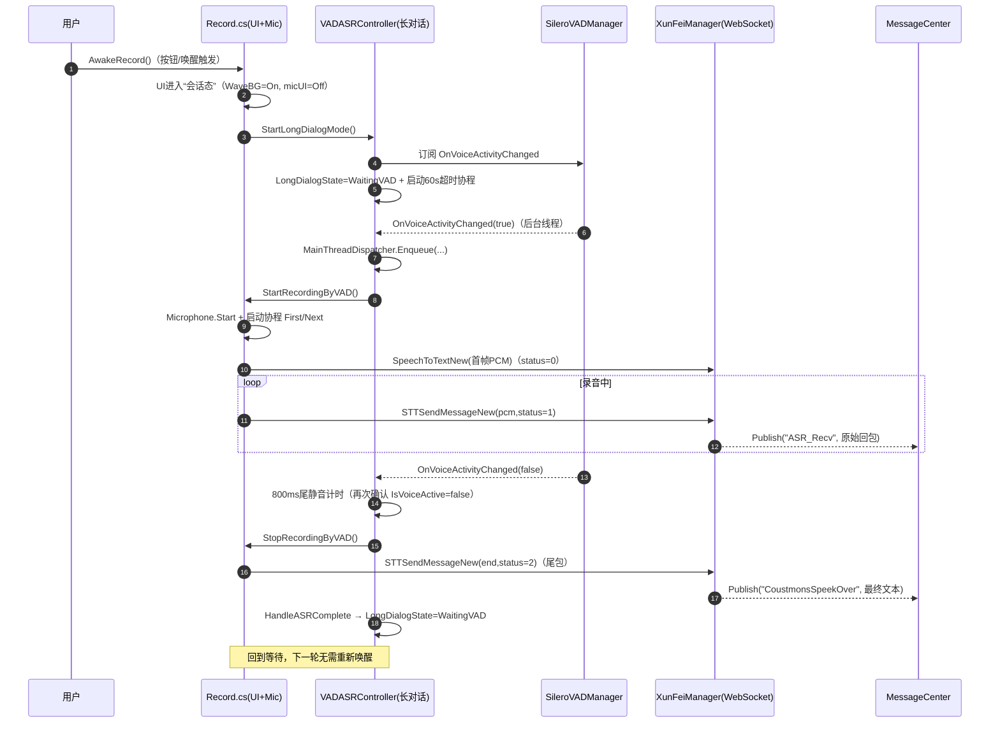
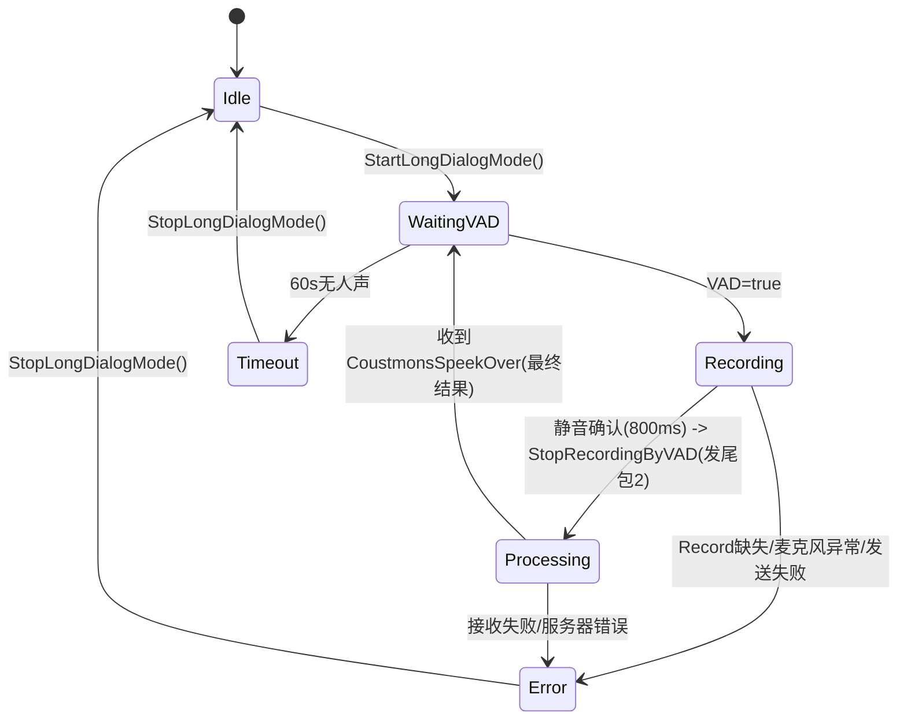

# 长对话模式协作与排障手册（VAD + 讯飞 ASR + Record）

  

面向：新同事快速上手与修 bug。目标：看完能回答两件事：

1) “长对话模式”到底由哪些组件协作完成；2) 出问题时该从哪里下手定位与修复。

  

---

  

## 0. 一页速览（先记住这句话）

  

长对话 = **唤醒一次进入“会话态”** → **VAD 持续监听** → 检测到人声才 **启动 Unity Microphone 录音** → 通过 **讯飞 WebSocket 流式发送（0/1/2 三态包）** → 静音确认后发 **尾包(2)** → 收到最终识别后回到 **WaitingVAD**，继续下一轮（直到超时/手动退出）。

  

---

  

## 1. 组件分工（谁负责什么）

  

| 组件 | 文件 | 关键职责 | 关键输出/依赖 |

|---|---|---|---|

| VAD 检测（Silero） | `Assets\\c#\\System\\VAD\\SileroVADManager.cs` | 持续采集麦克风音频并跑 ONNX，判定“有人声/静音” | 事件 `OnVoiceActivityChanged(bool)`（在后台线程触发）；方法 `IsVoiceActive()`；依赖 ONNX 模型与 NAudio |

| 长对话协调器 | `Assets\\c#\\System\\VAD\\VADASRController.cs` | **长对话状态机**：订阅 VAD → 触发录音开始/结束 → 等待 ASR 结果 → 回到等待 | `StartLongDialogMode()`/`StopLongDialogMode()`；`LongDialogState`；依赖 `Record`、`SileroVADManager`、`MessageCenter`、`MainThreadDispatcher` |

| 录音与送帧（Unity Microphone） | `Assets\\AIChatTookit\\Speech\\Record.cs` | UI 交互 + 启动/停止录音 + 把 `AudioClip` 切片成 PCM16 并流式发送 | 长对话入口 `EnterLongDialogMode()`；VAD 触发 `StartRecordingByVAD()`/`StopRecordingByVAD()`；协程 `GetAudoiDataFirst()` + `GetAudoiDataNext()` |

| 讯飞 ASR（WebSocket） | `Assets\\AIChatTookit\\Speech\\StrmingBranch\\XunFeiManager.cs` | 建立 WebSocket + 发送三态包 + 接收并解析结果 | `SpeechToTextNew(byte[])`（发首包并开始接收）；`STTSendMessageNew(byte[], status)`（中间/尾包）；接收侧发布 `MessageCenter.Publish("ASR_Recv")` 与 `MessageCenter.Publish("CoustmonsSpeekOver")` |

|（可选/目前易混淆）会话管理器 | `Assets\\AIChatTookit\\Speech\\StrmingBranch\\XunFeiSessionManager.cs` | 另一条“会话式”封装（连接生命周期/接收线程） | **注意：当前实现只发 `status=1` 音频帧**，与长对话主链路不是一套；新人排障先忽略它，除非你明确要走这条路 |

| 主线程调度 | `Assets\\c#\\System\\VAD\\MainThreadDispatcher.cs` | 将后台线程事件切回 Unity 主线程执行 | `MainThreadDispatcher.Enqueue(Action)` |

| 全局消息总线 | `Assets\\c#\\FrameWork\\MessageCenter.cs` | 解耦各模块（ASR 回包/唤醒/状态变化等） | `Subscribe/Publish`；**Publish 时 foreach 遍历 List，修改订阅列表会抛异常** |

  

---

  

## 2. 两条“ASR链路”并存：先分清（新人最常踩坑）

  

项目里同时存在两套 VAD→ASR 启动方式：

  

### A) 长对话主链路（本文重点）

- 入口：`Record.AwakeRecord()` → `Record.EnterLongDialogMode()` → `VADASRController.StartLongDialogMode()`

- 录音：`Record.StartRecordingByVAD()`（启动 `GetAudoiDataFirst/GetAudoiDataNext`）

- 讯飞：`XunFeiManager.SpeechToTextNew()` + `STTSendMessageNew()`（真正的 0/1/2 流式）

- 状态机：`LongDialogState`（WaitingVAD/Recording/Processing/Timeout…）

  

### B) “短对话/自动ASR”链路（容易与长对话冲突）

- 入口：`VADASRController.HandleVADStateChanged()`（`VADASRState` 状态机）

- 录音：`Record.StartByVAD()`（启动 `GetAudoiDataNextVAD`）

- 讯飞：`XunFeiSessionManager`（目前只发 status=1，中间帧逻辑，未完整）

  

**重要：长对话模式开启时，如果 `VADASRController.isEnabled = true`，两套链路会同时订阅 VAD 事件，可能出现：抢麦克风/重复连接/状态错乱/“有时能用有时不能”。**

排障第一步：看日志判断当前到底走的是哪条链路（见第 5 节）。

  

---

  

## 3. 长对话主流程（从唤醒到多轮对话）

  

### 3.1 时序图（推荐新人按这个走一遍）

  

  

### 3.2 长对话状态机（`LongDialogState`）

  

  

---

  

## 4. 关键实现点（新人读代码最省时间的路径）

  

### 4.1 入口：进入长对话“会话态”

  

- `Record.AwakeRecord(...)`

  - 做 UI：`WaveBG.SetActive(true)`、`microphoneUi.SetActive(false)`、`MaskUi` 等

  - **关键：不再立即录音，而是** `EnterLongDialogMode()`

- `Record.EnterLongDialogMode()`

  - `_isInLongDialogMode = true`

  - 调 `VADASRController.Instance.StartLongDialogMode()`

  

### 4.2 VAD 事件如何安全触发 Unity 逻辑

  

- `SileroVADManager` 在处理线程里 `OnVoiceActivityChanged?.Invoke(isVoiceActive)`

- `VADASRController.HandleLongDialogVAD(bool)` 里用 `MainThreadDispatcher.Enqueue(...)` 切回主线程

  - **不允许**在后台线程里直接调用 Unity API / `Record` / `Coroutine`

  

### 4.3 录音与切片（为什么是 640 samples）

  

`Record.StartRecordingByVAD()`：

- `Microphone.Start(null, false, 60, 16000)`

- 并行启动两条协程：

  - `GetAudoiDataFirst()`：等到缓冲区累计到 640 samples 后，取 **第一帧**并调用 `XunFeiManager.SpeechToTextNew(...)`（相当于“首包+开启接收循环”）

  - `GetAudoiDataNext()`：每帧读“新增音频”，按 640 samples 切片不断发送 `status=1`

  

> 640 samples @ 16kHz ≈ 40ms。该粒度兼顾延迟与吞吐；同时和多处日志/处理逻辑强绑定，不建议随意改。

  

### 4.4 讯飞三态包（0/1/2）怎么闭环

  

`XunFeiManager.STTCreateJsonData(status, bytes)`（核心协议点）：

- `status=0`：首帧（带 `common/business`），且会设置 `business.vad_eos=3000`（服务端 VAD 超时兜底）

- `status=1`：中间帧（持续音频）

- `status=2`：尾帧（`audio=""`），触发服务端尽快结算并回 `status=2`

  

`Record.StopRecordingByVAD()`：

- 发送尾包：`STTSendMessageNew(endPacket, 2)`（当前实现为 fire-and-forget：`_ = ...`）

- 停协程 + `Microphone.End`，但**不**调用 `OnSelence()`（保持 UI 仍在“会话态”）

  

`XunFeiManager.STTReceiveMessage()`：

- 每次回包都 `MessageCenter.Publish("ASR_Recv", rawJson)`

- 最终回包会 `MessageCenter.Publish("CoustmonsSpeekOver", finalText)`

  

`VADASRController.HandleASRComplete(result)`：

- 仅在 `_longDialogState == Processing` 时把状态拉回 `WaitingVAD`

  

---

  

## 5. 快速判定“当前在跑哪条链路”（看日志最快）

  

### 看到这些，大概率在跑 **长对话主链路（A）**

- `[Record] ========== 进入长对话模式 ==========`

- `[VADASRController] ========== 长对话模式启动 ==========`

- `[VADASRController] Long Dialog - ...`

- `HYF XunFeiManager Connect -- 开始连接...`

- `开始录音了GetAudoiDataNext`

- `语音识别收到 status = ...` / `讯飞语音转文本：...`

- `MessageCenter: CoustmonsSpeekOver`（间接表现为 UI/逻辑接到最终文本）

  

### 看到这些，说明启用了 **短对话链路（B）**（或两条都在跑）

- `[VADASRController] VAD: Voice Detected/Silence`

- `[VADASRController] ASR Session started: ...`

- `[XunFeiSessionMgr] Connected successfully` / `Receive loop started`

- `[Record] Starting recording by VAD`（注意是 `StartByVAD()` 里的日志）

  

> 一旦确认两条链路同时出现，优先先“停掉其中一条”，否则你会在“抢麦/抢连接”的随机态里排 bug。

  

---

  

## 6. 常见问题（症状 → 根因 → 定位点 → 修复建议）

  

### 6.1 VAD 有日志，但没有触发录音

- 症状：能看到 `[VAD] 🎤 检测到人声`，但没有 `[Record] VAD触发：开始录音`

- 常见根因：

  - `VADASRController` 没进入长对话：`StartLongDialogMode()` 未被调用

  - `Record` 未注册进 controller：`_record == null`，会看到 `Record instance not found!`

- 定位点：

  - `Record.EnterLongDialogMode()` 是否执行

  - `Record.RegisterToVADASRController()` 是否成功（有 `[Record] Successfully registered...`）

- 修复建议：

  - 确保场景中存在 `VADASRController` / `SileroVADManager` 且先于 `Record` 初始化

  - 或让 `Record` 在 controller 创建后重试注册（避免一次性注册失败）

  

### 6.2 录音开始了，但不出识别结果 / 一直卡在 Processing

- 症状：`[Record] VAD触发：停止录音（发送尾包）` 后迟迟没有最终文本

- 常见根因：

  - `status=2` 尾包未真正发送成功（`STTSendMessageNew` fire-and-forget，且 WebSocket 可能已断）

  - WebSocket 连接状态标志 `isConnectted` 与真实 `webSocket.State` 不一致

- 定位点：

  - `XunFeiManager.STTSendMessageNew` 是否打印 “WebSocket 未连接”

  - `XunFeiManager.STTReceiveMessage` 是否收到 `data.status==2`

- 修复建议：

  - 在关键路径把尾包发送改为可观测/可等待（至少记录发送结果）

  - 在关闭连接后明确复位 `isConnectted=false`，避免发送协程误判

  

### 6.3 经常“少字/尾字丢失”

- 常见根因：尾静音延迟太短（800ms）或 VAD 抖动导致过早发尾包

- 定位点：`VADASRController.longDialogVADSilenceDelayMs`、`SileroVADManager` 阈值/平滑

- 修复建议：

  - 适当增大 `longDialogVADSilenceDelayMs`（例如 1000~1500ms）做 A/B

  - 提升 `longDialogMinVoiceDurationMs` 过滤噪声触发

  

### 6.4 UI 显示“已退出”，但后台还在继续 VAD 自动触发

- 症状：你点击遮罩层关闭后，过一会又自动开始录音/发包

- 常见根因：`OnClickCloseRecord()` 当前只做 `OnSelence()` + 发尾包，**没有调用 `ExitLongDialogMode()`**

- 定位点：`Record.OnClickCloseRecord()`

- 修复建议：

  - 明确“点击关闭”到底是“仅结束本轮录音”还是“退出长对话模式”

  - 若是退出：调用 `ExitLongDialogMode()` 并确保 controller `StopLongDialogMode()` 清理订阅/协程

  

### 6.5 同时出现两套 ASR 链路的日志（随机好/随机坏）

- 症状：同一次说话里同时出现 `[VADASRController] ASR Session started` 和 `HYF XunFeiManager Connect`

- 根因：长对话模式订阅 VAD + `isEnabled=true` 仍会触发短对话状态机

- 修复建议：

  - 长对话模式启动时，**临时禁用短对话链路**（例如关闭 `isEnabled` 或取消订阅 `HandleVADStateChanged`）

  - 或从架构上做二选一：统一只保留一条可维护链路

  

### 6.6 “Collection was modified” 异常导致链路看起来“突然退出”

- 背景：`MessageCenter.Publish`/业务协程里 foreach 遍历 List 时修改集合会抛 `InvalidOperationException`

- 处理建议：排障时先确认是不是 UI/业务逻辑异常导致程序退出/重启，而不是 VAD/ASR 本身

  

---

  

## 7. 新人排障流程（照着做，10分钟内定位大方向）

  

1) **先看日志判链路**：只要两套链路同时出现，先停掉一套再排。  

2) **确认 VAD 正常**：必须看到 `[VAD] 🎤` 和 `[VAD] 🔇`。没有就先修 `SileroVADManager`（模型路径、麦克风、阈值）。  

3) **确认长对话状态机正常**：应看到 `Long Dialog State: WaitingVAD -> Recording -> Processing -> WaitingVAD`。  

4) **确认录音与送帧正常**：应看到 `开始录音了GetAudoiDataNext`，且 `_lastPosCache` 持续增长。  

5) **确认 WebSocket 收发闭环**：应看到 Connect 成功、持续回包、最终 `status=2` 回包。  

6) **确认结果回到 WaitingVAD**：`CoustmonsSpeekOver` 必须发布，controller 才会准备下一轮。

  

---

  

## 8. 场景/配置检查清单（上线前必做）

  

- 场景中必须有：`SileroVADManager`、`XunFeiManager`、（建议显式放一个）`VADASRController`、UI 上的 `Record`。  

- Inspector 参数建议（先用默认，再按环境调）：

  - `SileroVADManager.threshold`：0.3~0.7（环境噪声大就提高）

  - `VADASRController.longDialogTimeoutSeconds`：60

  - `VADASRController.longDialogVADSilenceDelayMs`：800（尾字丢失就加大）

  - `VADASRController.longDialogMinVoiceDurationMs`：300（误触发多就加大）

- 网络与密钥：`XunFeiManager` 中存在硬编码 `APPID/APIKey/APISecret`（注意不要提交真实生产密钥到公共仓库；上线前按公司规范治理）。

  

---

  

## 9. 建议的后续“结构性修复”（可选，但很值）

  

> 这部分不是必须改，但能显著降低后续维护成本。

  

- **二选一**：明确只保留一条 ASR 链路（推荐：长对话用的 0/1/2 流式链路），删掉或补全另一条，避免长期“双系统互相抢资源”。  

- **退出语义统一**：把“点击遮罩层”明确成退出长对话（或仅结束本轮），并保证 UI/状态机一致。  

- **尾包发送可靠化**：尾包发送建议可观测（至少有成功/失败日志），必要时可 await 确认后再停协程/停麦克风。  

- **MessageCenter 安全化**：Publish 时对订阅列表做拷贝，避免回调里订阅/退订引发 `Collection was modified`。

  

---

  

如果你希望我下一步直接把文档里提到的“高风险点”（例如：两条链路冲突、点击遮罩层不退出长对话、尾包发送可靠性）改成代码级修复，我可以按优先级给出最小改动的补丁。